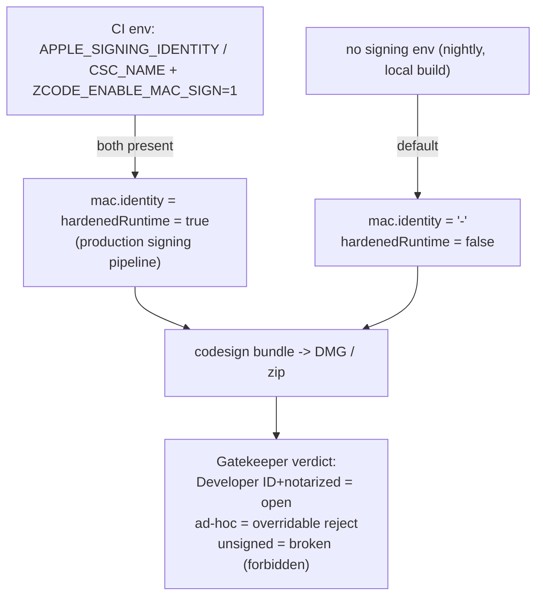

# Desktop packaging and code signing

Status: implemented. Covers the identity resolution rules used by `packages/desktop/electron-builder.config.js` and the nightly standalone distribution flow.

## Product contract

- macOS artifacts must always carry a self-consistent bundle signature: either a Developer ID signature (when CI provides credentials) or an ad-hoc signature (`identity: "-"`) when signing is not enabled.
- Fully unsigned macOS artifacts (`identity: null`) are a defect: on macOS Sequoia and later, a quarantined app without a valid signature shows the「已损坏，应该移到废纸篓」dialog, and System Settings offers no「仍要打开」bypass, so users cannot install the app without terminal commands.
- An ad-hoc signature does not satisfy notarization; Gatekeeper still rejects it on first launch, but with the overridable「无法验证开发者 / 无法检查恶意软件」path (System Settings → Privacy & Security → Open Anyway). This is the accepted trade-off for builds without an Apple Developer certificate.
- Windows and Linux artifacts are unaffected; they stay unsigned exactly as before.

## Ownership and boundaries

- `electron-builder.config.js` is the single owner of the signing identity decision; no workflow or script may override it with ad-hoc `codesign` calls after packaging.
- `afterPack` rewrites `app.asar` before electron-builder signs, so the final signature always seals the injected runtime modules; keep that ordering.
- The Preview flavor guard (fail when `ZCODE_ENABLE_MAC_SIGN=1` without an identity) is independent of this default and stays unchanged.

## Acceptance cases

- Build mac arm64 without signing env: `codesign --verify --deep --strict <ZCode>.app` exits 0; `spctl -a -t exec` reports `rejected` (untrusted), never an invalid-signature error.
- Copy the app to a machine on macOS Sequoia/Tahoe, set `com.apple.quarantine`, launch: the dialog is the「无法验证」variant with a System Settings bypass, not「已损坏」.
- With `ZCODE_ENABLE_MAC_SIGN=1` and a valid identity, behavior is identical to the previous production pipeline (Developer ID signing, hardened runtime, separate notarization stage).

## Validation record

- 2026-09-23: nightly `nightly-20260922` (petrel2015/ZCode) mac-arm64 DMG verified intact (SHA256 match, `hdiutil verify` pass), but `ZCode.app` had no `_CodeSignature`; `spctl` failed with「code has no resources but signature indicates they must be present」— the root cause of the user-facing「文件已损坏」report. After re-signing the same app ad-hoc locally, `codesign --verify` passed and `spctl` returned the overridable `rejected` verdict, confirming the ad-hoc default fixes the reported symptom.
