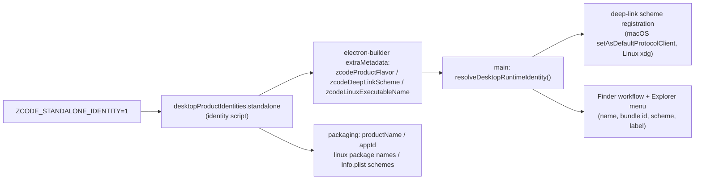

# Standalone identity and branding

Status: implemented. Covers the installable identity separation between the standalone distribution (this branch's nightly) and the official ZCode desktop builds, plus the rogue-nin battle-damaged mark used as its brand icon.

## Product contract

- The standalone distribution installs as **ZCode Standalone** and must coexist side by side with an official `ZCode` installation: different bundle ids, different app names, different user data directories, different Linux packages, different deep-link schemes, and different Finder/Explorer shell integrations. Neither installation may claim ownership of the other's registrations.
- Identity is selected at build time via `ZCODE_STANDALONE_IDENTITY=1` (same strict `1`/`0`/empty validation as `ZCODE_PREVIEW_IDENTITY`); it outranks the backend-env axis: a standalone build with `ZCODE_ENV=production` keeps production endpoints but takes the standalone identity.
- The single source of truth for identity is `desktopProductIdentities` in `packages/desktop/scripts/desktop-product-identity.mjs`. Runtime processes never re-derive it: electron-builder copies `zcodeProductFlavor`, `zcodeDeepLinkScheme`, and `zcodeLinuxExecutableName` into the packaged `package.json` (`extraMetadata`), and the main process reads that channel (`resolveDesktopRuntimeIdentity`). Dev fallback is the production identity.
- The brand mark is the "rogue ninja / battle-damaged" Z: the original black-squircle white italic Z with its two slice gaps, struck by a torn horizontal slash (missing-nin scratched-forehead-protector motif, monochrome), with battle damage (chips at stroke ends, cracks and debris around the slash, a chipped tile corner). Small sizes (≤64px) drop the damage detail and shorten the slash to stay legible. Source SVGs live in `packages/desktop/build/logo/`; `packages/desktop/scripts/generate-icon-assets.mjs` regenerates every packaged icon from them.
- The mark exists in three forms, and every form must be battle-damaged: (a) file assets (`build/logo/*.svg` and the PNG/ICNS/ICO they generate), (b) file-asset React imports (`logo-zai.svg`, `Z.svg`), and (c) **inline SVG glyphs** in components and HTML shells (transparent background, `fill="currentColor"`, simplified geometry with the slash kept as a cut-out, same path data everywhere).

## Brand render-point registry (exhaustive)

Every place the brand mark renders must be listed here. **A new brand render point must be registered in this list before it ships** — the #17 gap existed precisely because inline copies were never tracked anywhere.

In-UI inline glyphs (simplified battle-damaged geometry, `currentColor`):

- `packages/ui/src/components/ui/ZCodeAboutLogo.tsx` — onboarding welcome logo (`OnboardingWelcomeView`, rendered at 32px inside the dark rounded shell)
- `packages/ui/src/root/RootStartupLoading.tsx` — `ZCodeStartupLogo` (startup loading, data-upgrade screen `GlobalDatabaseStartupLoading`, occupation onboarding badge; rendered at 56px inside `ZCodeStartupLogoBadge`)

HTML shell inline glyphs (pre-React first paint, one copy each, same path data as the component glyphs):

- `packages/desktop/src/renderer/index.html` — desktop startup first-paint logo
- `packages/web/index.html` — web boot loading logo (`.zcode-boot-loading__logo`)

File-form assets:

- `packages/desktop/build/logo/standalone-mark.svg` / `standalone-mark-small.svg` — sources of truth (full ≥128px, simplified ≤64px)
- `packages/desktop/build/icon.*`, `icon_installer.*`, `icon_windows.png`, `build/icons/*` — packaged app/installer icons (generated)
- `packages/desktop/build/dmg_background.png` / `dmg_background@2x.png` — DMG install background (white + full battle-damaged Z + "ZCode Standalone" wordmark), generated from `packages/desktop/build/logo/dmg_background.svg`; `dmg.contents` icon coordinates (130,220)/(410,220) must stay clear of the wordmark
- `public/icon_512@2x.png` (repo root) — update dialog dock icon (generated, 1024×1024)
- `public/logo/icons/` (repo root) — archived icon set mirrored from `build/` by the generate script (icns/ico/all PNG sizes)
- `packages/web/public/favicon.ico` — web favicon (7-size ICO, sizes ≤64px use the simplified variant; `dist/` copies are build output, never hand-edited)
- `packages/ui/src/assets/logo-zai.svg`, `packages/ui/src/assets/Z.svg` — file-form in-UI marks (already battle-damaged since #8)

## Identity matrix

| Field                                           | production                                                      | standalone                                                                        |
| ----------------------------------------------- | --------------------------------------------------------------- | --------------------------------------------------------------------------------- |
| appId / Windows AUMID                           | `dev.zcode.app`                                                 | `dev.zcode.standalone`                                                            |
| productName (`.app`, userData dir, install dir) | `ZCode`                                                         | `ZCode Standalone`                                                                |
| Linux executable / package                      | `zcode`                                                         | `zcode-standalone`                                                                |
| deep-link scheme                                | `zcode`                                                         | `zcode-standalone`                                                                |
| Finder workflow name / bundle id                | `Open in ZCode.workflow` / `dev.zcode.app.finder-open-workflow` | `Open in ZCode Standalone.workflow` / `dev.zcode.standalone.finder-open-workflow` |
| Linux user-level desktop entry                  | `zcode.desktop` / `x-scheme-handler/zcode`                      | `zcode-standalone.desktop` / `x-scheme-handler/zcode-standalone`                  |

Preview identity is unchanged.

## Ownership and boundaries

- The scheme string is owned by the identity table; no main-process module may hardcode `zcode://` for registration or generated shell scripts.
- Linux user-level registration never writes an entry whose desktop-file id equals another flavor's id, so AppImage/deb installations of the two products cannot shadow each other in XDG resolution.
- Icon assets are build inputs checked into `packages/desktop/build/`; runtime and CI never regenerate them during packaging.

## Acceptance cases

- With `ZCODE_STANDALONE_IDENTITY=1`: artifacts are named `ZCode Standalone-<version>-...`, the macOS bundle is `ZCode Standalone.app` with `CFBundleIdentifier=dev.zcode.standalone`, `CFBundleURLTypes` declares only `zcode-standalone`, and `codesign` shows `Identifier=dev.zcode.standalone`.
- `ZCode Standalone.app` and an official `ZCode.app` both installed: separate userData dirs, both launchable, `zcode://` still routes to the official app, `zcode-standalone://` routes to the standalone app.
- Linux: `zcode-standalone.desktop` / `zcode.desktop` coexist; installing one never deletes or shadows the other's registrations.
- Every render point in the brand render-point registry (packaged icons, inline component glyphs, HTML shell glyphs, DMG background, update-dialog icon, archived icons, web favicon) renders the battle-damaged slash-Z; at 32px the simplified variant stays recognizable. Rerunning `generate-icon-assets.mjs` reproduces every generated asset in the registry.
- Without the env var, output is byte-for-byte the previous production identity (no filename or behavior drift for non-standalone builds).

## Validation record

- 2026-09-23: mockups iterated with pixel-level geometry checks and an external vision review; variant D (monochrome battle-damaged) selected by the product owner. Implementation and packaging validation recorded in the commit that adds the identity table entries and generated assets.
- 2026-09-24: end-to-end validation on nightly `nightly-20260923` (petrel2015/ZCode). `ZCode.Standalone-3.14.0-mac-arm64.dmg` verified: bundle `ZCode Standalone.app`, `CFBundleIdentifier=dev.zcode.standalone`, `CFBundleURLTypes` scheme `zcode-standalone`, ad-hoc signature `Identifier=dev.zcode.standalone` with `codesign --verify --deep --strict` passing and `spctl` returning the overridable `rejected` verdict (not "damaged"); packaged `package.json` carries `zcodeProductFlavor=standalone` / `zcodeDeepLinkScheme=zcode-standalone` / `zcodeLinuxExecutableName=zcode-standalone`; icon visually confirmed (black tile, white italic Z with slice gaps, torn slash, battle damage). Local build with `ZCODE_STANDALONE_IDENTITY=1` reproduced the same results. Tracked in #8.
