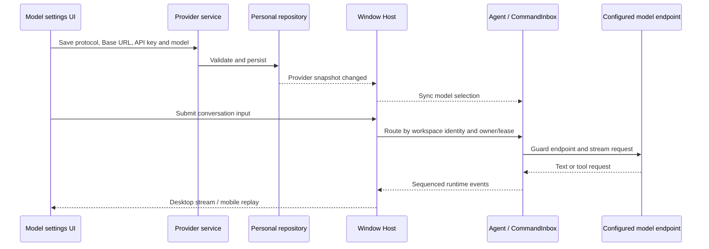

# Standalone runtime

Status: implemented; desktop acceptance completed with the validation limits below. Approved scope: remove ZCode platform services while retaining local coding and user-configured model providers.

## Product contract

- No product account, OAuth login, token refresh, billing, subscription, quota/reset, purchase UI, platform sharing, feedback, telemetry, update checks, official website or download links.
- No automatic or feature-triggered access to `zcode.z.ai` or `cdn-zcode.z.ai`, including startup with historical settings, cached providers and scheduled tasks. Domain rejection must happen before DNS/network dispatch; redirects must not bypass it.
- Models use the configured protocol, base URL, API key and model ID. No official gateway rewrite, entitlement lookup or fallback to a platform model. Missing/invalid credentials produce configuration errors.
- Built-in model templates and required plugin assets are local. Personal providers and local plugins remain available; third-party MCP authentication remains independent.
- Remove cron and off-peak task management, background processes and automatic dispatch. Ordinary conversation admission, tool scheduling, workflow execution, owner/lease routing, cancellation and recovery remain intact.

## Ownership and boundaries

The Provider service remains the single configuration owner. Credentials use the existing credential/config storage paths. Renderer is a projection, not a second configuration authority.

Conversation command admission remains in CommandInbox. Desktop continuous streaming and mobile replayable recovery retain the same runtime owner and sequence. Identity remains `workspaceIdentity?.trim() || workspacePath`.

Legacy account credentials and retired task records are not read for runtime admission or resumed. No destructive database migration or deletion of user conversations, projects, credentials or personal providers is included. Retired provider selections require explicit replacement, never implicit paid execution.

## Implementation order

1. Direct model transport and local provider configuration.
2. Product OAuth/account, commercial services, sharing and feedback removal.
3. Cron/off-peak UI, service registration, protocol and process removal.
4. Updates, remote configuration, telemetry, official links and CDN dependencies removal.
5. Dependency/documentation cleanup and full validation.

## Acceptance cases

- Fresh and historical profiles start without login, token refresh or platform requests.
- API-key provider configuration persists across restart; missing key and rejected key do not open login or use another endpoint.
- Mock model verifies configured destination, streaming, tool call, cancellation and continuation. Paid live GLM calls require a separate bounded budget.
- Historical cron/off-peak records never execute. Ordinary manual task and workflow execution remain available.
- Desktop and Web settings expose no retired feature entrypoints; keyboard/mobile/theme behavior remains usable.
- Static scan explains all remaining retired-domain mentions (tests, historical migration recognition, deny policy, this spec).
- Runtime network evidence covers startup, idle, settings, workspace switch, mock conversation and restart; zero DNS/HTTP/WebSocket dispatches to retired domains. A denied attempt is a defect to trace, not proof that feature cleanup is complete.
- Run root and CLI typecheck/lint, architecture check, targeted behavioral tests, UI E2E and desktop build. Record actual results and remaining limitations.

## Validation record

- Initial baseline: architecture check passed, 0 violations; clean worktree; main synchronized with origin/main.
- Root `pnpm typecheck`: passed. CLI `pnpm --dir apps/zcode-cli typecheck`: 27/27 passed.
- Root `pnpm lint`: passed with 30 warnings. CLI Lint: still fails on max-lines. Exhaustive per-package comparison reports the same 86 file/rule errors in baseline and current source, with no additions.
- Architecture: 0 violations. Seven local-provider/transport/provisioning tests passed. `node scripts/check-standalone-surface.mjs` passed.
- Agent bundle and `pnpm --dir packages/desktop build:no-runtime-assets`: passed. CLI bundle `--help` exposes no login/logout.
- Desktop: no-login startup; persisted provider URL/key/model and conversation history recovered; mock Anthropic streaming, Bash printf tool/result continuation, stop generation, settings/help and saved-workflow list verified.
- Network observation: Node HTTP/DNS destinations were loopback and the existing third-party MCP; Chromium and Node audit logs contained zero retired-domain requests. Denial tests cover direct URLs, subdomains, case/port variants and redirects.
- No paid GLM request, production migration, account credential deletion, or real scheduled-task execution was performed.
- See [validation details](../standalone-validation.md) for extra-check failures and coverage limits.
