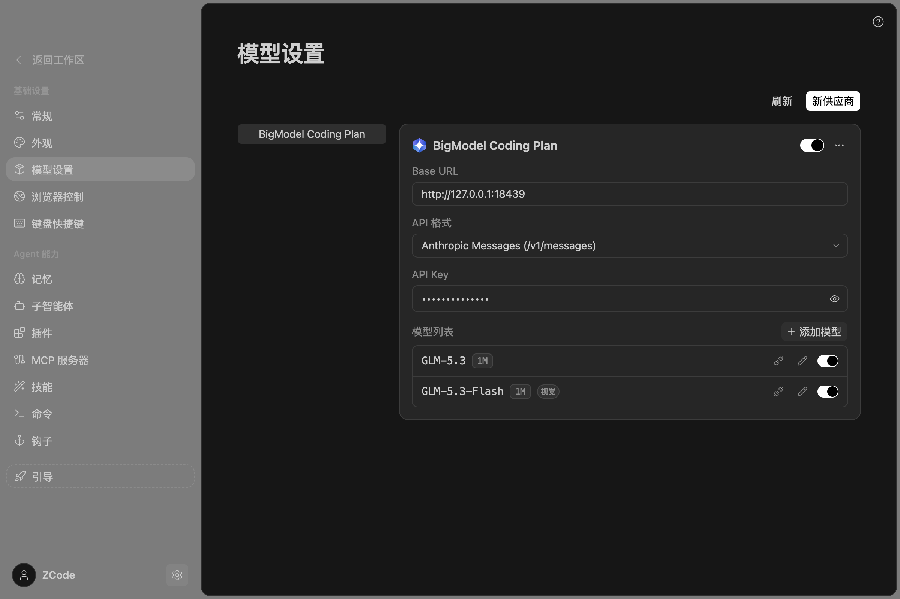
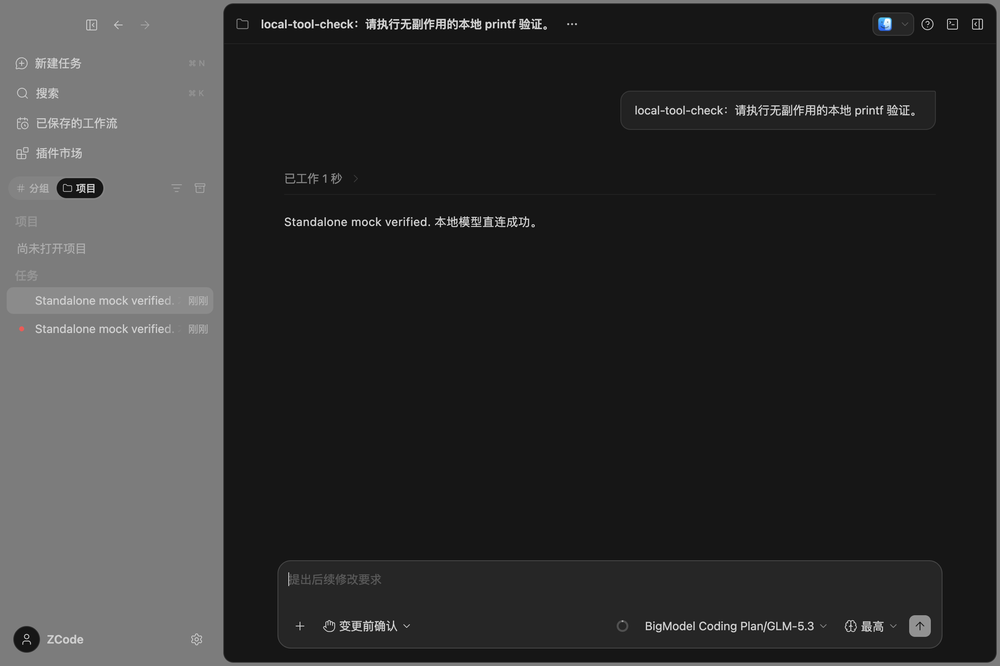

# 独立版本验收记录

本次移除了平台账户/OAuth、账单/权益、定时和闲时任务、工单、平台分享、更新、远程配置、官方链接与遥测发送。GLM 使用本地 Provider 配置的协议、Base URL、API Key 和模型 ID 直连。旧账户凭据与历史任务数据不做破坏性清除。

## 已执行

| 检查                                        | 结果                                                                                                   |
| ------------------------------------------- | ------------------------------------------------------------------------------------------------------ |
| 根项目 `pnpm typecheck`                     | 通过                                                                                                   |
| CLI `pnpm --dir apps/zcode-cli typecheck`   | 27/27 通过                                                                                             |
| 根项目 `pnpm lint`                          | 0 错误、30 警告                                                                                        |
| `pnpm architecture:check --changed`         | 0 违规                                                                                                 |
| Provider/transport/provisioning 测试        | 7/7 通过                                                                                               |
| `node scripts/check-standalone-surface.mjs` | 通过                                                                                                   |
| Agent 打包与 `build:no-runtime-assets`      | 通过；仍有体积提示                                                                                     |
| CLI bundle `--help`                         | 正常，无 login/logout                                                                                  |
| 桌面交互                                    | 启动、配置恢复、历史会话、本地模型流式回答、Bash 工具结果续答、取消生成、设置/帮助、手动工作流列表通过 |

模型验收使用 `127.0.0.1:18439` 的 Anthropic Messages 模拟服务和假密钥，不产生 GLM 费用。测试目录位于 `/tmp/zcode-standalone-e2e/`，未覆盖用户现有密钥。截图、交互快照、模型请求摘要、Node HTTP/DNS 和 Chromium netlog 均保存在该目录。网络摘要只记录目标主机；模型日志不记录密钥或正文。

网络观测覆盖启动、闲置、设置、历史会话、模拟模型调用、取消与重新启动。观测到的 Node 网络目标为本机模拟服务和已配置的 `mcp.deepwiki.com`；Node/Chromium 日志均未出现两个退役域名。源码和 Agent 产物没有对应默认 URL；域名文本仅保留在拒绝策略及测试中。

## 未通过与验证边界

- CLI 独立 Lint 仍未通过 `max-lines`。提交前对每个 CLI 包运行相同版本的 oxlint：基线与当前源码均有 86 条错误，规则及文件集合完全一致，没有新增。此前 Turbo 提前停止只报告了其中 56 个文件；完整结果以本次对照为准。
- 额外的 desktop main/preload 独立 `tsc --noEmit` 仍未通过。提交前将基线 `872ad96` 源码解压到隔离目录，重建根项目引用后对照：基线 86 条、当前 79 条，减少 7 条、没有新增。对比忽略行号、绝对目录及联合类型成员顺序。复用同一已安装第三方依赖；这证明的是当前工具链下的源码差异，不是另一套全新依赖安装的结果。根项目类型检查不包含这两个独立工程。
- 全仓 Markdown 链接检查仍有 31 处缺失目标，均已存在于基线（基线 34 处）；主要来自第三方许可证正文的原始相对路径和既有依赖说明。本次修改的 README、变更记录和新增文档没有失效相对链接，并修正了 README 的两处既有失效链接。
- 未验证真实 GLM 账户、Windows/Linux 安装包、完整 Web/手机远控端到端链路、真实跨 Host 工作流执行及全量历史数据库升级。原有 owner/lease、workspace identity、手动工作流和移动端恢复边界保持原实现。
- 第三方 MCP OAuth、浏览器访问、用户配置的模型/插件端点仍可使用。拒绝策略约束应用传输，不是限制用户自行执行 shell/外部程序网络访问的系统防火墙。
- 兼容旧数据所需的记录/类型仍保留；已移除模块没有服务注册、工具入口或后台进程，不会恢复旧定时任务。

## 提交前复核

目标个人仓库为 `petrel2015/ZCode`，分支为 `feat/standalone-glm`；上游 `zai-org/ZCode` 不接收本次推送。应用版本没有改变。

重新执行根项目/CLI 类型检查、`pnpm verify:pre-push`、7 项针对性测试、静态边界检查和桌面构建。结构化基线对照见 [standalone-baseline-comparison.json](validation/standalone-baseline-comparison.json)。已知失败没有新增，仍如上保留记录。

真实桌面测试截图（本地模拟服务、假密钥）：





## 复核命令

从仓库根目录执行，Node 版本按 `mise.toml`：

```sh
node scripts/check-standalone-surface.mjs
node --import tsx --test packages/provider-node/test/*.test.ts packages/services/test/standaloneProvisioning.test.ts
pnpm typecheck
pnpm --dir apps/zcode-cli typecheck
pnpm lint
pnpm architecture:check --changed
node scripts/build-desktop-agent-cli.mjs
pnpm --dir packages/desktop build:no-runtime-assets
```

检查必须先于最终桌面构建：仓库的 TypeScript 和 tsup 共用部分 `out/` 路径，构建后再次执行会发射文件的类型检查会覆盖打包产物。`build:no-runtime-assets` 使用当前已准备的运行时资源；它不代表已验证所有平台资源下载和安装包签名。
